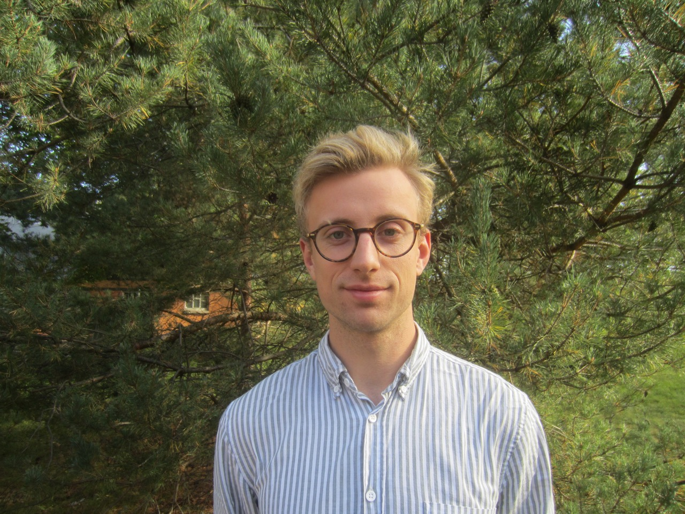

# Tobias Wängberg

{:height="50%" width="50%"}

I am a Master's student in mathematical statistics at Stockholm University. 
Currently, my interests lie within causal inference, data science and philosophy. 

## Publications

I stayed for one semester at the Australian National University where I wrote my 
bachelor thesis in game theory. 
I was supervised by [Marcus Hutter](http://www.hutter1.net/) and [Tom Everitt](https://www.tomeveritt.se/).

* [here](http://liu.diva-portal.org/smash/record.jsf?pid=diva2%3A1106499&dswid=-199) 
which

[article](./article.pdf)
[OSG paper](https://arxiv.org/abs/1708.03871)

## CV

Here is [my CV](./CVeng.pdf) for more information about my background.

